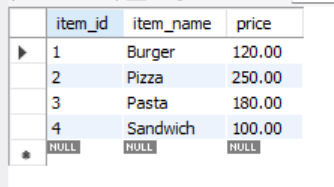
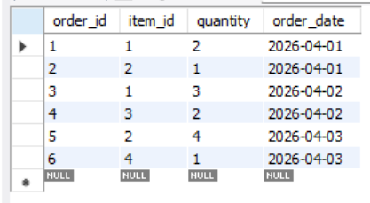
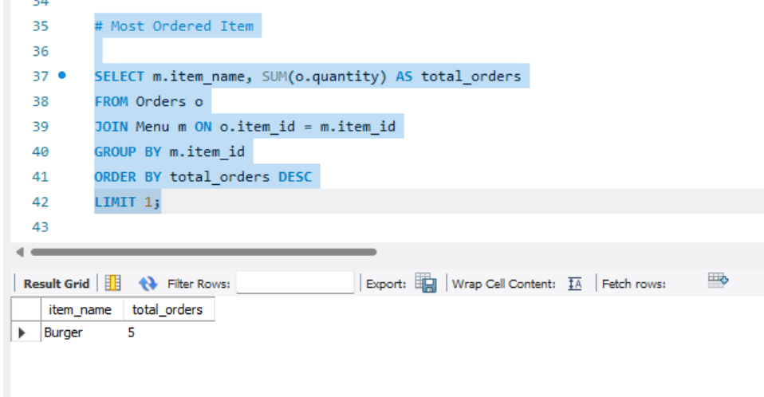
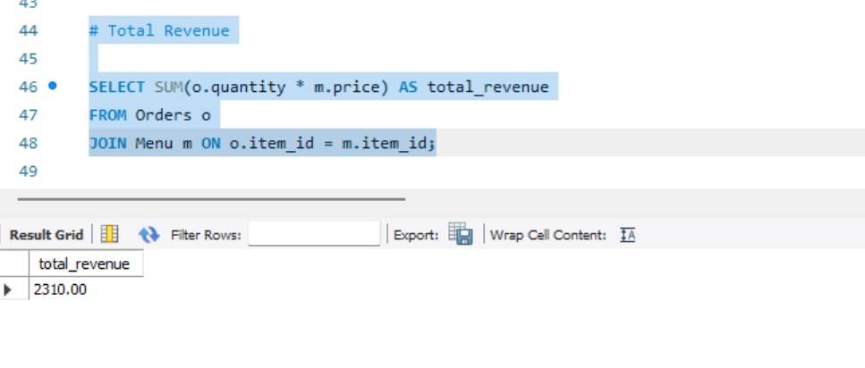
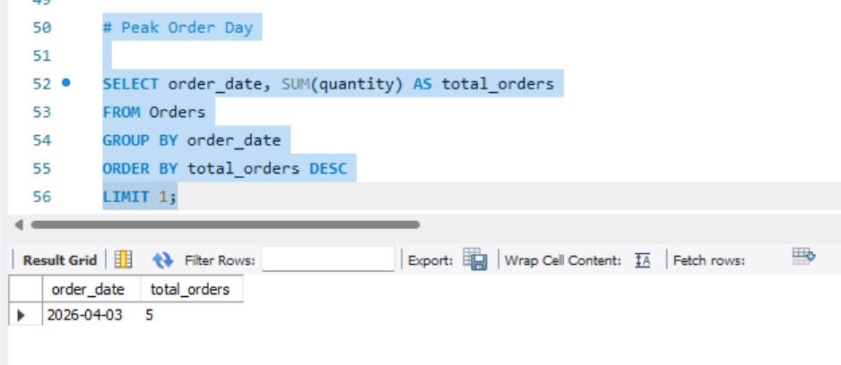

# Restaurant Order Analysis System

## Problem Statement

Develop a SQL-based system to analyze restaurant orders and sales data to generate useful business insights.

##  Features

* Store menu items with prices
* Track customer orders
* Identify most ordered item
* Calculate total revenue
* Find peak order day
* Perform data analysis using SQL queries

---

## Technologies Used

* MySQL
* SQL (DDL, DML, Queries)
* Joins & Aggregate Functions

---

## Database Structure

### Menu Table

* `item_id` → Item ID
* `item_name` → Food item name
* `price` → Price of item

### Orders Table

* `order_id` → Order ID
* `item_id` → Reference to menu
* `quantity` → Quantity ordered
* `order_date` → Date of order

---

## How to Run

1. Open MySQL Workbench
2. Create database and tables
3. Insert sample data
4. Execute queries to view results

---

## Output Screenshots

 
<b>Menu Table</b>

  

 
<b>Orders Table</b>

  

 
<b>Most Ordered Item</b>

  

 
<b>Total Revenue</b>

  

 
<b>Peak Order Day</b>

---
